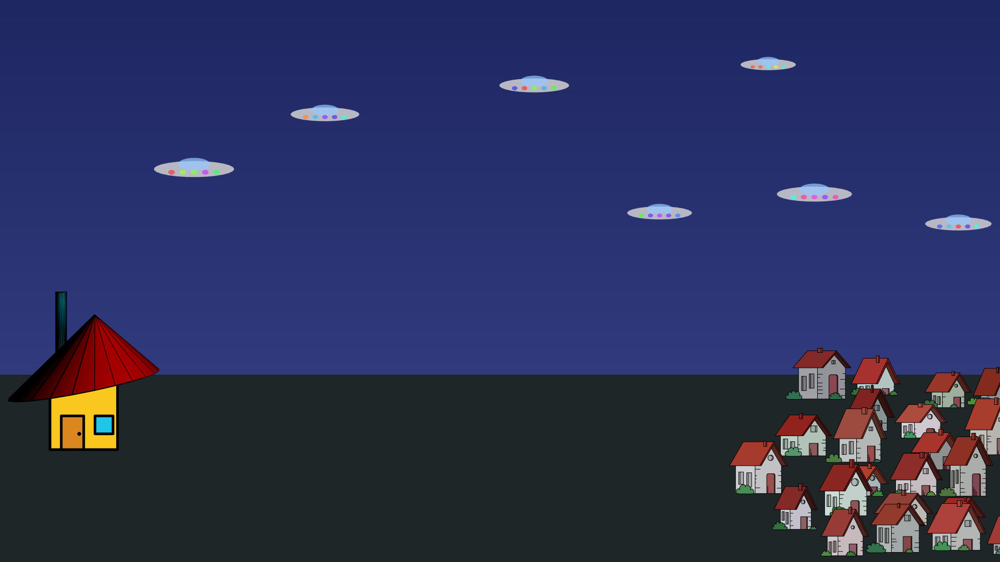

# Cityscape

()[https://aidanwyber.github.io/Cityscape/]

**Cityscape** is a collaborative, generative artwork by the Creative Coding Amsterdam community using [p5.js](https://p5js.org/).

Each contributor adds a unique code fragment that forms part of a shared city.

[Run the artwork in your browser.](https://aidanwyber.github.io/Cityscape/)

---

## Rules

1. The canvas has a fixed size: 3840 x 2160 pixels (4K).
2. The title of the piece is "Cityscape".
3. When contributing, you only add code and don't remove any from others, unless absolutely necessary to keep it running.
4. The project stops at 10,000 lines of code.

Run the piece in your browser.

---

## Contributing

We’re building a collaborative, browser-rendered community artwork using **p5.js (global mode)**.
All contributions live in `contributors/<your-name>/` and are loaded on the page via `<script>` tags in `/index.html`.

### 1. Fork & set up locally

1. **Fork** this repository to your GitHub account.
2. **Clone** your fork locally.
3. Launch a simple local server to view `index.html` (needed to run p5.js):
    - With Node.js: `npx serve` (then open the shown URL)
    - With Python: `python3 -m http.server` and open `http://localhost:8000`
    - Have PHP? `php -S localhost:8000` and open `http://localhost:8000`

### 2. Create a feature branch

```bash
git checkout -b feat/your-name-your-piece
```

Use a descriptive branch name (e.g., feat/aidan-earth-and-sky).

### 3. Adding to the piece

#### Folder & file structure

Create a folder for yourself and put your code there:

```bash
contributors/
  your-name/
    my-piece.js
    (optional) assets/
      texture.png
```

#### File naming

Use lowercase, hyphenated names (e.g., earth-and-sky.js).

If you add assets, keep them small (<1MB if possible).

#### Include your script in `index.html`

```html
<body>
	<!-- your contribution(s): add below -->
	<!-- (in the order of the `functions` array) -->

	<script src="contributors/aidan/earth-and-sky.js"></script>
	<script src="contributors/<your-name>/<your-script>.js"></script>

	<!-- sketch.js must run last -->
	<script src="sketch.js"></script>
</body>
```

Load order matters: your file should be available before sketch.js runs.

## 4. How to get your changes into the main project

To contribute directly to this project:

1. Commit your changes with a clear message

```bash
git add .
git commit -m "feat(contributors/your-name): add 'Earth and Sky' layer"
```

2. Push the branch to your fork

```bash
git push -u origin feat/your-name-your-piece
```

3. Open a pull request to the upstream repo

-   Title: feat: add your-name — piece title
-   Description: What your layer does, any knobs, and screenshots/gifs if helpful.

#### Pull request checklist:

-   [ ] My script is placed under `contributors/<my-name>/`.
-   [ ] I added my `<script>` before `sketch.js` in `index.html`.
-   [ ] I did not define a global `setup()` or `draw()` in my contribution.
-   [ ] Assets (if any) are small and inside contributors/<my-name>/assets/.

---

## Licensing

This project combines open-source code and creative visual output.
To balance freedom of use with community collaboration, it uses **dual licensing**:

### Code

All code in this repository (including HTML, CSS, and JavaScript) is licensed under the [MIT License](./LICENSE).

You are free to:

-   Use, copy, modify, merge, publish, and distribute the code.
-   Include it in commercial or non-commercial projects.
    Just make sure to **credit the original authors**.

### Artwork/visual output

All visual assets, generative artwork, and design concepts are licensed under the [Creative Commons Attribution-ShareAlike 4.0 International License (CC BY-SA 4.0)](https://creativecommons.org/licenses/by-sa/4.0/).

You are free to:

-   Share and remix the visuals for any purpose.
-   Adapt and transform the artwork, even commercially.

As long as you:

-   Give **appropriate credit**.
-   Share any derivative works under the **same CC BY-SA 4.0 license**.

```

```
